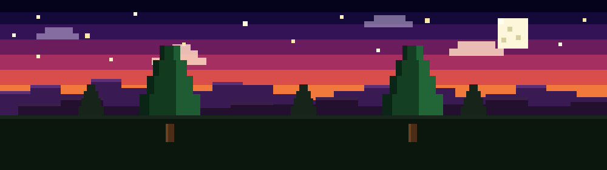
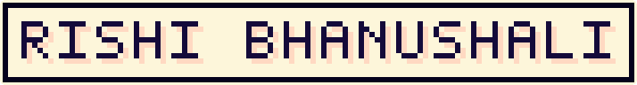

<div align="center">



<br/><br/>



<br/>

[](https://git.io/typing-svg)

<br/>

<a href="https://rishiportfolio-eta.vercel.app"></a>
<a href="https://linkedin.com/in/rishi-bhanushali-65480832a/"></a>
<a href="https://github.com/bhanushali222"></a>
<a href="mailto:rishibhanushali747@gmail.com"></a>
<a href="https://raw.githubusercontent.com/bhanushali222/bhanushali222/main/assets/resume.pdf"></a>


</div>

<br/>

```text
██╗    ██╗██╗  ██╗ ██████╗     █████╗ ███╗   ███╗   ██╗
██║    ██║██║  ██║██╔═══██╗   ██╔══██╗████╗ ████║   ██║
██║ █╗ ██║███████║██║   ██║   ███████║██╔████╔██║   ██║
██║███╗██║██╔══██║██║   ██║   ██╔══██║██║╚██╔╝██║   ██║
╚███╔███╔╝██║  ██║╚██████╔╝   ██║  ██║██║ ╚═╝ ██║   ██║
 ╚══╝╚══╝ ╚═╝  ╚═╝ ╚═════╝    ╚═╝  ╚═╝╚═╝     ╚═╝   ╚═╝
```

```yaml
engineer:
  role:        Full Stack Developer @ ZootechX
  education:   3rd Year CSE (Data Science) @ DJSCE
  domains:     System Design · Backend Engineering · AI · Full-Stack
  focus:       Distributed Systems · RAG Pipelines · Low-Latency APIs · Interactive UIs
  mindset:     "Architect for scale, code for clarity, optimize for performance."
```


<br/><br/>

```text
████████╗███████╗ ██████╗██╗  ██╗    ███████╗████████╗ █████╗  ██████╗██╗  ██╗
╚══██╔══╝██╔════╝██╔════╝██║  ██║    ██╔════╝╚══██╔══╝██╔══██╗██╔════╝██║ ██╔╝
   ██║   █████╗  ██║     ███████║    ███████╗   ██║   ███████║██║     █████╔╝
   ██║   ██╔══╝  ██║     ██╔══██║    ╚════██║   ██║   ██╔══██║██║     ██╔═██╗
   ██║   ███████╗╚██████╗██║  ██║    ███████║   ██║   ██║  ██║╚██████╗██║  ██╗
   ╚═╝   ╚══════╝ ╚═════╝╚═╝  ╚═╝    ╚══════╝   ╚═╝   ╚═╝  ╚═╝ ╚═════╝╚═╝  ╚═╝
```

<table width="100%">
  <tr>
    <td width="50%" valign="top" align="center">
      <h3>Languages & Core</h3>
      <a href="https://isocpp.org"></a> &nbsp;
      <a href="https://www.python.org"></a> &nbsp;
      <a href="https://www.typescriptlang.org"></a> &nbsp;
      <a href="https://developer.mozilla.org/en-US/docs/Web/JavaScript"></a>
    </td>
    <td width="50%" valign="top" align="center">
      <h3>Backend & Real-Time Orchestration</h3>
      <a href="https://fastapi.tiangolo.com"></a> &nbsp;
      <a href="https://nodejs.org"></a> &nbsp;
      <a href="https://expressjs.com"></a> &nbsp;
      <a href="https://socket.io"></a> &nbsp;
      <a href="https://redis.io"></a> &nbsp;
      <a href="https://celeryproject.org"></a>
    </td>
  </tr>
  <tr>
    <td width="50%" valign="top" align="center">
      <h3>AI & RAG</h3>
      <a href="https://www.langchain.com"></a> &nbsp;
      <a href="https://playwright.dev"></a> &nbsp;
       &nbsp;
       &nbsp;
       &nbsp;
       &nbsp;
       &nbsp;
      
    </td>
    <td width="50%" valign="top" align="center">
      <h3>Frontend & UI Engineering</h3>
      <a href="https://developer.mozilla.org/en-US/docs/Web/HTML"></a> &nbsp;
      <a href="https://developer.mozilla.org/en-US/docs/Web/CSS"></a> &nbsp;
      <a href="https://developer.mozilla.org/en-US/docs/Web/JavaScript"></a> &nbsp;
      <a href="https://react.dev"></a> &nbsp;
      <a href="https://nextjs.org"></a> &nbsp;
      <a href="https://vitejs.dev"></a> &nbsp;
      <a href="https://tailwindcss.com"></a> &nbsp;
      <a href="https://threejs.org"></a> &nbsp;
      <a href="https://github.com/pmndrs/zustand"></a>
    </td>
  </tr>
  <tr>
    <td colspan="2" valign="top" align="center">
      <h3>Databases, DevOps & Cloud</h3>
      <a href="https://mongodb.com"></a> &nbsp;
      <a href="https://mongoosejs.com"></a> &nbsp;
      <a href="https://firebase.google.com"></a> &nbsp;
       &nbsp;
       &nbsp;
       &nbsp;
       &nbsp;
       &nbsp;
       &nbsp;
      <a href="https://dexie.org"></a> &nbsp;
      <a href="https://git-scm.com"></a> &nbsp;
      <a href="https://github.com"></a> &nbsp;
      <a href="https://vercel.com"></a>
    </td>
  </tr>
</table>


<br/><br/>

```text
███████╗████████╗ █████╗ ████████╗███████╗
██╔════╝╚══██╔══╝██╔══██╗╚══██╔══╝██╔════╝
███████╗   ██║   ███████║   ██║   ███████╗
╚════██║   ██║   ██╔══██║   ██║   ╚════██║
███████║   ██║   ██║  ██║   ██║   ███████║
╚══════╝   ╚═╝   ╚═╝  ╚═╝   ╚═╝   ╚══════╝
```

<div align="center">


<br/><br/>


</div>


<br/><br/>

```text
███████╗██╗  ██╗██████╗ ███████╗██████╗ ██╗███████╗███╗   ██╗ ██████╗███████╗
██╔════╝╚██╗██╔╝██╔══██╗██╔════╝██╔══██╗██║██╔════╝████╗  ██║██╔════╝██╔════╝
█████╗   ╚███╔╝ ██████╔╝█████╗  ██████╔╝██║█████╗  ██╔██╗ ██║██║     █████╗
██╔══╝   ██╔██╗ ██╔═══╝ ██╔══╝  ██╔══██╗██║██╔══╝  ██║╚██╗██║██║     ██╔══╝
███████╗██╔╝ ██╗██║     ███████╗██║  ██║██║███████╗██║ ╚████║╚██████╗███████╗
╚══════╝╚═╝  ╚═╝╚═╝     ╚══════╝╚═╝  ╚═╝╚═╝╚══════╝╚═╝  ╚═══╝ ╚═════╝╚══════╝
```

| Role | Company | Duration | Highlights |
|:--|:--|:--|:--|
| **Full Stack Developer Intern** | Zootechx (Remote) | Mar 2026 – Present | Developed scalable full-stack SaaS applications, intelligent lead generation platforms, business automation workflows, web scraping pipelines, RESTful APIs, and real-time systems while building the company's official website. |


<br/><br/>

```text
██████╗ ██████╗  ██████╗      ██╗███████╗ ██████╗████████╗███████╗
██╔══██╗██╔══██╗██╔═══██╗     ██║██╔════╝██╔════╝╚══██╔══╝██╔════╝
██████╔╝██████╔╝██║   ██║     ██║█████╗  ██║        ██║   ███████╗
██╔═══╝ ██╔══██╗██║   ██║██   ██║██╔══╝  ██║        ██║   ╚════██║
██║     ██║  ██║╚██████╔╝╚█████╔╝███████╗╚██████╗   ██║   ███████║
╚═╝     ╚═╝  ╚═╝ ╚═════╝  ╚════╝ ╚══════╝ ╚═════╝   ╚═╝   ╚══════╝
```

| Project | What it does | Stack |
|:--|:--|:--|
| **Decibel** <a href="https://github.com/bhanushali222/NOVA"> | Ultra-low-latency real-time AI voice agent with client-side VAD, concurrent Web Workers, and embedding-based memory retrieval | `React` `TypeScript` `Three.js` `ONNX Runtime Web` `Dexie` `Zustand` `Groq API` |
| **Leadly** <a href="https://github.com/bhanushali222/Leadly"> | Agentic multi-agent lead discovery & enrichment platform with automated scoring and AI-generated outreach | `FastAPI` `MongoDB` `ChromaDB` `Playwright` `Redis` `Celery` `Groq API` |
| **MatchFlow** <a href="https://github.com/bhanushali222/Matchflow"> | Full-stack freelance marketplace with role-based dashboards, real-time comms, and secure auth | `React` `Node.js` `Express` `Firebase` `JWT` `Socket.IO` |


<br/><br/>

```text
███████╗██████╗ ██╗   ██╗ ██████╗ █████╗ ████████╗██╗ ██████╗ ███╗   ██╗
██╔════╝██╔══██╗██║   ██║██╔════╝██╔══██╗╚══██╔══╝██║██╔═══██╗████╗  ██║
█████╗  ██║  ██║██║   ██║██║     ███████║   ██║   ██║██║   ██║██╔██╗ ██║
██╔══╝  ██║  ██║██║   ██║██║     ██╔══██║   ██║   ██║██║   ██║██║╚██╗██║
███████╗██████╔╝╚██████╔╝╚██████╗██║  ██║   ██║   ██║╚██████╔╝██║ ╚████║
╚══════╝╚═════╝  ╚═════╝  ╚═════╝╚═╝  ╚═╝   ╚═╝   ╚═╝ ╚═════╝ ╚═╝  ╚═══╝
```

| Institution | Degree | Score | Years |
|:--|:--|:--|:--|
| Dwarkadas J. Sanghvi College of Engineering | B.Tech CSE (Data Science) (3rd Year) | CGPA 9.67 | 2024 – 2028 |
| Pace Junior Science College | HSC | 82.33% | 2022 – 2024 |
| Pawar Public School | ICSE | 94.16% | 2010 – 2022 |


<br/><br/>

```text
██╗   ██╗██╗ ██████╗████████╗ ██████╗ ██████╗ ██╗███████╗███████╗
██║   ██║██║██╔════╝╚══██╔══╝██╔═══██╗██╔══██╗██║██╔════╝██╔════╝
██║   ██║██║██║        ██║   ██║   ██║██████╔╝██║█████╗  ███████╗
╚██╗ ██╔╝██║██║        ██║   ██║   ██║██╔══██╗██║██╔══╝  ╚════██║
 ╚████╔╝ ██║╚██████╗   ██║   ╚██████╔╝██║  ██║██║███████╗███████║
  ╚═══╝  ╚═╝ ╚═════╝   ╚═╝    ╚═════╝ ╚═╝  ╚═╝╚═╝╚══════╝╚══════╝
```

- 🥇 &nbsp;**HackOps 2025** — Winner (1st Position)
- 🥇 &nbsp;**Lines of Code 8.0** — Domain Winner (Web-App)
- 🎖️ &nbsp;**PPSB MUN** — Best Delegate & Best Position Paper


<br/><br/>

```text
██████╗ ███████╗██╗   ██╗ ██████╗ ███╗   ██╗██████╗
██╔══██╗██╔════╝╚██╗ ██╔╝██╔═══██╗████╗  ██║██╔══██╗
██████╔╝█████╗   ╚████╔╝ ██║   ██║██╔██╗ ██║██║  ██║
██╔══██╗██╔══╝    ╚██╔╝  ██║   ██║██║╚██╗██║██║  ██║
██████╔╝███████╗   ██║   ╚██████╔╝██║ ╚████║██████╔╝
╚═════╝ ╚══════╝   ╚═╝    ╚═════╝ ╚═╝  ╚═══╝╚═════╝
```

- **DJS ARYA** — Software Team Member
- **DJS CodeAI** — Tech & Web Co-Committee Member, Projects Co-Committee Member
<p align="center"><b>🔭 &nbsp;Currently exploring System Design · Distributed Systems · AI</b></p>

<br/><br/>

```text
 ██████╗ ██████╗ ███╗   ██╗███╗   ██╗███████╗ ██████╗████████╗
██╔════╝██╔═══██╗████╗  ██║████╗  ██║██╔════╝██╔════╝╚══██╔══╝
██║     ██║   ██║██╔██╗ ██║██╔██╗ ██║█████╗  ██║        ██║
██║     ██║   ██║██║╚██╗██║██║╚██╗██║██╔══╝  ██║        ██║
╚██████╗╚██████╔╝██║ ╚████║██║ ╚████║███████╗╚██████╗   ██║
 ╚═════╝ ╚═════╝ ╚═╝  ╚═══╝╚═╝  ╚═══╝╚══════╝ ╚═════╝   ╚═╝
```

Open to AI/Software/Full Stack roles, collabs, and anything at the intersection of **Systems × AI × Scale**.

<div align="center">
  <a href="https://linkedin.com/in/rishi-bhanushali-65480832a/"></a> &nbsp;
  <a href="https://rishiportfolio-eta.vercel.app"></a> &nbsp;
  <a href="mailto:bhanushalirishi747@gmail.com"></a>
</div>

<br/><br/>

<p align="center">
  
</p>


<!-- 
SEO Metadata Block
Keywords: Rishi Bhanushali, Software Engineer, Full Stack Developer, AI Engineer, System Design, Distributed Systems, RAG Pipelines, Backend Developer Mumbai, DJSCE CSE Data Science, React Developer, FastAPI, Node.js, Python, TypeScript, Software Engineer Mumbai, Competitive Programmer, Hackathon Winner
Description: Portfolio and GitHub Profile of Rishi Bhanushali, a Full Stack & AI Software Engineer specializing in scalable distributed architectures, RAG pipelines, and interactive web application frontends.
-->
